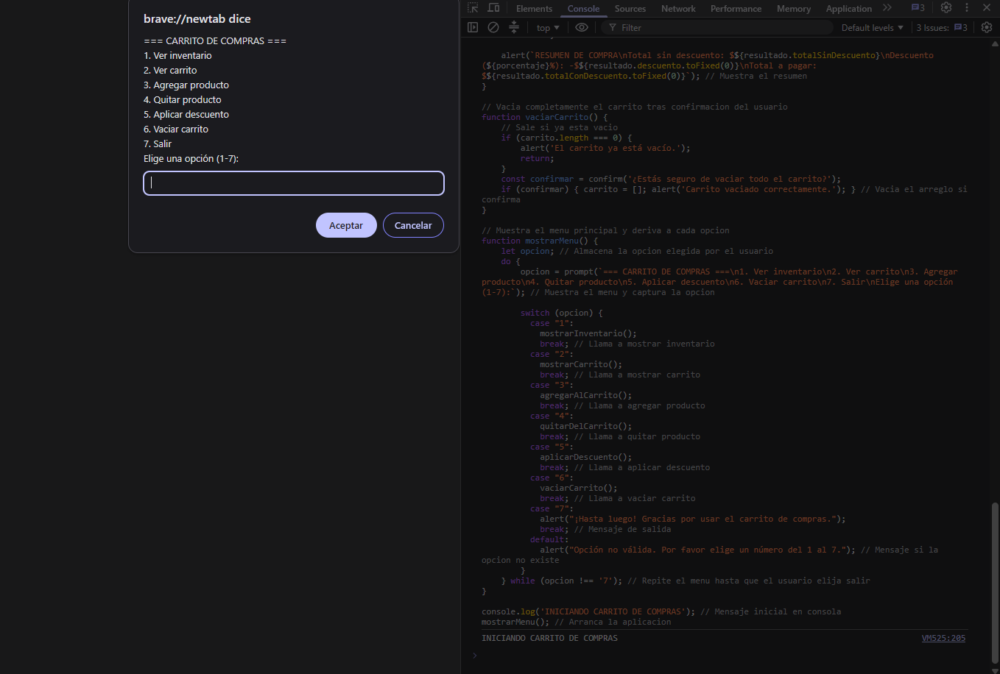
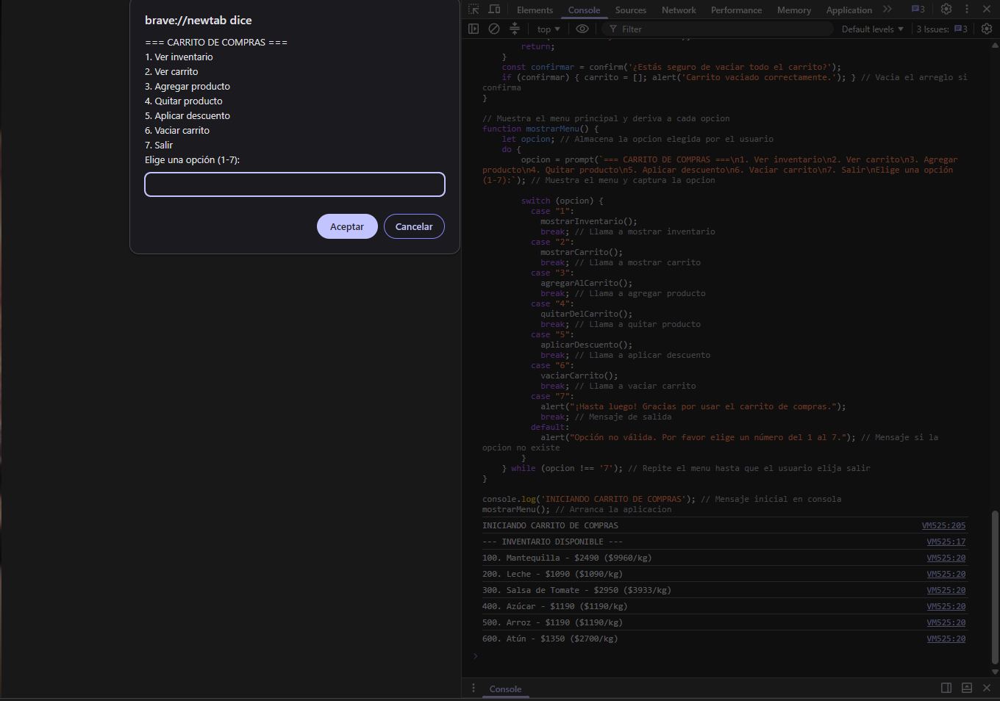
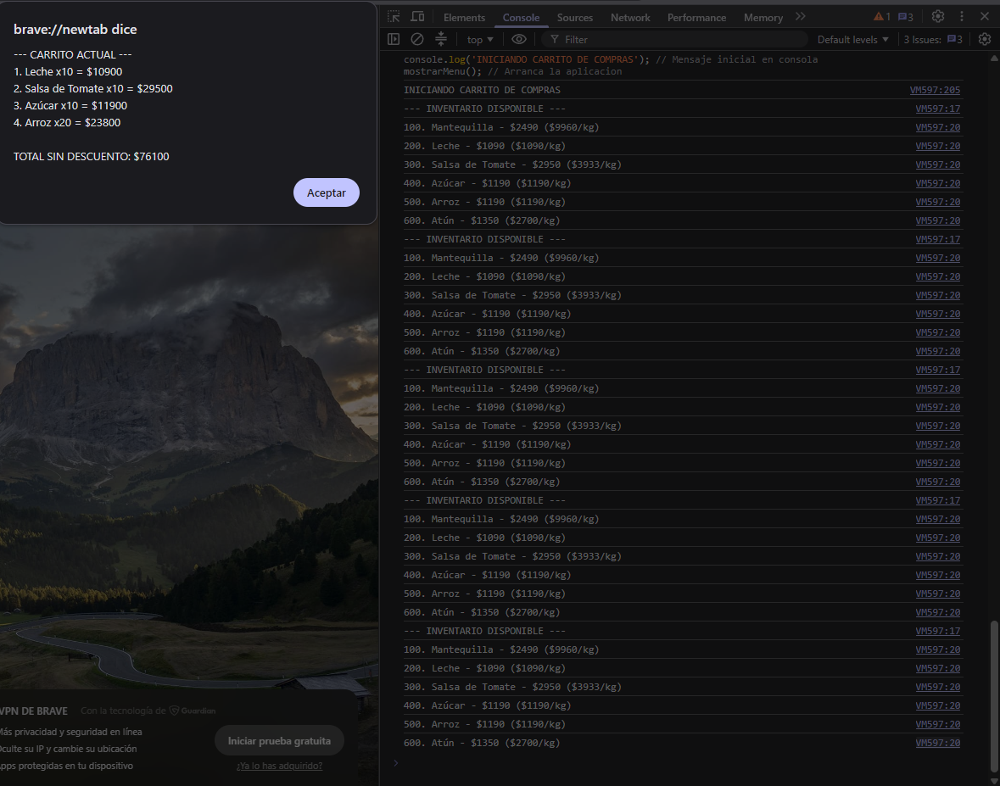

# 🛒 Carrito de Compras — Aplicación de Consola

> **Módulo 3 — Fundamentos de Programación en JavaScript**  
> Proyecto: Aplicación interactiva en consola para gestionar un carrito de compras

---

## 📍 Descripción del Proyecto

Aplicación de consola que simula un sistema de carrito de compras. El usuario puede consultar un inventario de productos, agregarlos al carrito, quitarlos, aplicar un descuento porcentual y vaciar el carrito por completo, todo a través de un menú interactivo construido con `prompt()`, `alert()` y `confirm()`.

El proyecto cumple con los requerimientos del Módulo 3: uso de **arreglos**, **objetos**, **funciones**, **estructuras condicionales** (`if`, `switch`) y **bucles** (`for`, `do...while`), junto con **validación de entradas** del usuario.

---

## ⚙️ Funcionalidades

| Opción del menú | Función | Descripción |
|---|---|---|
| 1 | `mostrarInventario()` | Lista todos los productos disponibles con su precio y precio por kilo |
| 2 | `mostrarCarrito()` | Muestra los productos agregados, sus subtotales y el total acumulado |
| 3 | `agregarAlCarrito()` | Agrega un producto al carrito por ID, o suma cantidad si ya existe |
| 4 | `quitarDelCarrito()` | Reduce o elimina un producto del carrito según la cantidad indicada |
| 5 | `aplicarDescuento()` | Calcula y muestra el total aplicando un porcentaje de descuento |
| 6 | `vaciarCarrito()` | Vacía el carrito completo, previa confirmación del usuario |
| 7 | — | Finaliza la ejecución del programa |

---

## 🧱 Estructuras de Datos

### Inventario (arreglo de objetos)

Cada producto es un objeto con su propio método para calcular el precio por kilo:

```js
{ id: 100, nombre: 'Mantequilla', precio: 2490, peso: 0.25, precioPorKilo() { return this.precio / this.peso; } }
```

| Propiedad | Tipo | Descripción |
|---|---|---|
| `id` | number | Identificador único del producto |
| `nombre` | string | Nombre del producto |
| `precio` | number | Precio en pesos |
| `peso` | number | Peso en kilogramos |
| `precioPorKilo()` | método | Calcula `precio / peso` dinámicamente |

### Carrito (arreglo dinámico)

Se construye en tiempo de ejecución a partir de los productos seleccionados:

```js
{ id: producto.id, nombre: producto.nombre, precio: producto.precio, cantidad: cantidad }
```

---

## 🔁 Estructuras de Control Utilizadas

| Estructura | Dónde se usa |
|---|---|
| `for` | Recorrer `inventario` y `carrito` para mostrarlos o sumar totales |
| `do...while` | Bucle principal del menú (`mostrarMenu()`), se repite hasta elegir "Salir" |
| `switch` | Derivar la opción elegida del menú a la función correspondiente |
| `if` | Validaciones de ID, cantidad, porcentaje y estados del carrito |

---

## ✅ Validaciones Implementadas

- **ID de producto:** debe ser un número entero existente en el inventario.
- **Cantidad:** debe ser un número entero positivo (`validarCantidad()`).
- **Cantidad a quitar:** no puede exceder la cantidad actual en el carrito.
- **Porcentaje de descuento:** debe estar entre 0 y 100.
- **Carrito vacío:** se bloquean las acciones de ver, quitar, descontar o vaciar si no hay productos.
- **Confirmación:** vaciar el carrito requiere confirmación explícita (`confirm()`).

---

## 🛠️ Tecnologías

- **Lenguaje:** JavaScript (ES6+)
- **Entorno de ejecución:** Consola del navegador (usa `prompt`, `alert`, `confirm`)

---

## 🚀 Cómo Ejecutar

1. Abre cualquier navegador (Chrome, Firefox, Edge).
2. Abre una pestaña en blanco o cualquier sitio web.
3. Presiona `F12` (o clic derecho → **Inspeccionar**) para abrir las herramientas de desarrollador.
4. Ve a la pestaña **Console**.
5. Copia y pega el contenido de `carrito_compras.js`, luego presiona `Enter`.
6. Sigue las instrucciones del menú interactivo.

> ⚠️ El programa usa `prompt()`, `alert()` y `confirm()`, por lo que **no funciona en Node.js**; debe ejecutarse en el contexto de un navegador.

---

## 📁 Estructura del Proyecto

```
app_carrito_compras/
├── carrito_compras.js   # Lógica completa de la aplicación
├── screenshots/         # Capturas de Pantalla
└── README.md            # Este documento
```

---
## Capturas de pantalla

### Menú principal


### Inventario disponible


### Carrito con productos

---

## 📦 Inventario Disponible

| ID | Producto | Precio | Peso |
|---|---|---|---|
| 100 | Mantequilla | $2.490 | 250 g |
| 200 | Leche | $1.090 | 1 L |
| 300 | Salsa de Tomate | $2.950 | 750 g |
| 400 | Azúcar | $1.190 | 1 kg |
| 500 | Arroz | $1.190 | 1 kg |
| 600 | Atún | $1.350 | 500 g |

---

## 📌 Conceptos Aplicados

| Concepto | Implementación |
|---|---|
| Variables | `let carrito`, `const inventario`, acumuladores de totales |
| Arreglos | `inventario`, `carrito`, métodos `find()`, `push()`, `splice()` |
| Objetos | Productos con propiedades y método propio `precioPorKilo()` |
| Funciones | Una función por responsabilidad (mostrar, buscar, validar, agregar, quitar) |
| Condicionales | `if` para validaciones, `switch` para el menú |
| Bucles | `for` para recorrer arreglos, `do...while` para el menú principal |
| Validaciones | Funciones dedicadas (`validarCantidad`) y chequeos `isNaN` / `Number.isInteger` |

---

## 💡 Posibles Mejoras Futuras

- Persistir el carrito en `localStorage` para no perderlo al recargar.
- Reemplazar `prompt`/`alert` por una interfaz gráfica (HTML + jQuery o framework).
- Agregar control de stock disponible por producto.
- Permitir múltiples descuentos acumulables o cupones con código.

---

## 👥 Equipo de Desarrollo

> whiterabbit DS.